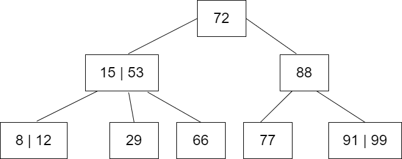
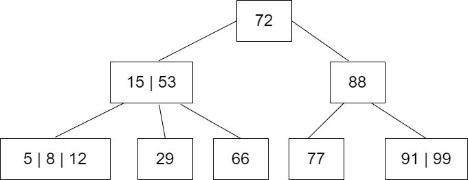
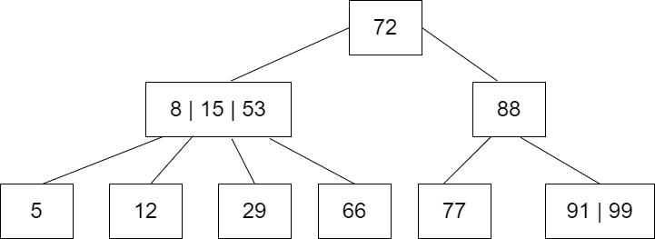
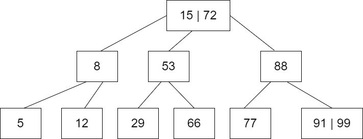
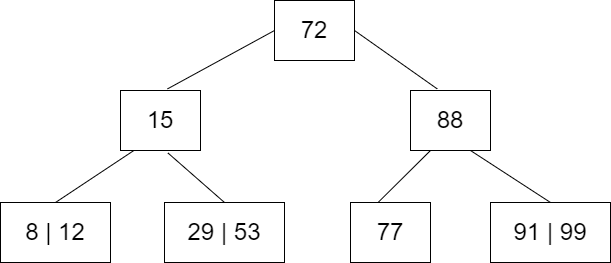
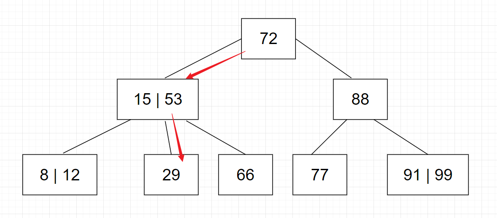

# 0410-BTree
Self Learning of Data Structure &amp; Alogorithm -- B Tree

Just a note taking for my study plan in data structure

## Self Learning Data Structure & Algorithm

### What is B Tree?
A B-tree is a self-balancing tree data structure (multiplexed lookup tree) that stores associative arrays (key-value) and provides fast lookup, insertion, and deletion operations.A B-tree is characterized by the fact that each node can have multiple children (the largest number of children of a node in the tree is called the order of the B-tree pair) and the children are ordered in size among themselves, which enables fast lookups.The height of a B-tree is usually The height of B-trees is usually low, so the time complexity of lookup, insertion and deletion operations is O(log n).

<br/>

### Create New Node in B Tree
```c++
BTreeNode* createNode(int value, BTreeNode* child)
{
  BTreeNode* newnode = new BTreeNode;
  newnode->value[1] = value;
  newnode->count = 1;
  newnode->child[0] = root;
  newnode->child[1] = child;
  return newnode;
}
```
<br/>

### Traversal in B Tree
<b>B-tree traversal</b> usually consists of three types: pre-order traversal, mid-order traversal and post-order traversal

- Pre-order traversal: Visit the root node first, then recursively traverse the left and right subtrees first.
```c++
void preorder(BTreeNode* myNode)
{
  int i;
  if (myNode)
  {
    for (i = 0; i < myNode->count; i++)
    {
      cout << myNode->value[i + 1] << " ";
      preorder(myNode->child[i]);
    }
    preorder(myNode->child[i]);
  }
}
```

- Middle-order traversal: first recursively traverses the left subtree in middle order, then visits the root node, and finally recursively traverses the right subtree in middle order.
```c++
void traversal(BTreeNode* myNode)
{
  int i;
  if (myNode)
  {
    for (i = 0; i < myNode->count; i++)
    {
      traversal(myNode->child[i]);
      cout << myNode->value[i + 1] << " ";
    }
    traversal(myNode->child[i]);
  }
}
```

- Post-order traversal: recursively traverses the left and right subtrees, then accesses the root node.
```c++
void postorder(BTreeNode* myNode)
{
  int i;
  if (myNode)
  {
    for (i = 0; i < myNode->count; i++)
    {
      postorder(myNode->child[i]);
    }
    postorder(myNode->child[i]);
    for (i = 0; i < myNode->count; i++)
    {
      cout << myNode->value[i + 1] << " ";
    }
  }
}
```
<b>B-tree traversal</b> is different from <b>Binary Tree</b> because B-tree nodes may have multiple children, so B-tree traversal needs to be performed according to specific rules.

For example, for a B-tree node which contains n keywords and n+1 pointers to subtrees. For a non-leaf node, the number of sub-tree pointers is always 1 more than the number of keywords. in the middle-order traversal, we traverse the keywords in the order from smallest to largest, so a non-leaf node needs to be traversed in the following way:
- traversing subtree 0;
- traversing keyword 0;
- traversing subtree 1;
- traversing keyword 1;
- and so on, traversing through all subtrees and keywords.

For leaf nodes, they do not have subtrees, so they only need to be traversed in the order of the keywords.

<br/>

### Insert, Delete and Search in B Tree

<b>A Three Dimension B Tree</b>

<div align="center">
   
</div>


<details>
<summary>Insert</summary>
I would like to insert a new value 5 into the B-Tree given. So, it successfully found its node location by comparing the size of the key/value
<br><br>

`Step 1 of insert`
  Now, the modified node has 3 values 5, 8 and 12. However, it violates the rule in the B-Tree (any node in the sequential B-Tree can have at most n-1 values).
<div align="center">
   
</div>
<br><br>

`Step 2 of insert`
To recover the B-Tree, split the intermediate values 5, 8, and 12 into two nodes. Then, insert a new value 8 in the middle of the current node, splitting the current node into two nodes. Finally, the two split nodes are used as the left and right children of the original node. The left child node contains the value 5 and the right child node contains the value 12.
<div align="center">
   
</div>
<br><br>

`Step 3 of insert`
  Now, the parent node violates the B-Tree definition. So, restore it.
<div align="center">
   
</div>
<br><br>

```c++
void insertValueInBTree(int value)
{
  int flag, i;
  BTreeNode* child;

  flag = setValueIntoNode(value, &i, root, &child);
  if (flag)
    root = createNode(i, child);
}
```
</details>

<details>
<summary>Delete</summary>
I would like to delete the node of value 66 from the B-Tree above, the first step is to match the size of the 66 values to find the correct location.

- If the node is a leaf node, delete the node directly. If it is not a leaf node, find the smallest node in the right subtree or the largest node in the left subtree of the node, assign its value to the node to be deleted, and then delete the smallest or largest node.

- If, after deleting a node, the number of keywords in its node is less than the minimum value of the node (usually, n/2), then a node merge or keyword redistribution operation is required.

<br><br>
<div align="center">
   
</div>

```c++
void deleteValueFromBTree(int value, BTreeNode* myNode)
{
  BTreeNode* temp;
  if (!deleteValueFromNode(value, myNode))
  {
    cout << "The value " << value << " is not present in the B-Tree" << endl;
    return;
  }
  else
  {
    if (myNode->count == 0)
    {
      temp = myNode;
      myNode = myNode->child[0];
      free(temp);
    }
    root = myNode;
  }
}
```
</details>

<details>
<summary>Search</summary>
I would like to search the index value of 29. So, it will search with the way (70 > (15<29)? && (29<53)? > 29 ), from the middle of Nodes 15 & 53

<div align="center">
   
</div>


```c++
void searchValueInBTree(int value, int* position, BTreeNode* myNode)
{
  if (!myNode) return;

  if (value < myNode->value[1]) *position = 0;
  else
  {
    for (*position = myNode->count;
      (value < myNode->value[*position] && *position > 1);
      (*position)--);

      if (value == myNode->value[*position])
      {
        cout << "The value " << value << " is present in the B-Tree" << endl << endl;
        return;
      }

      cout << "The value " << value << " is not present in the B-Tree" << endl << endl;

  }
  searchValueInBTree(value, position, myNode->child[*position]);
  return;
}
```
</details>


### How the nodes/leaves shift
For understaning easily, you may refer the website: [https://www.cs.usfca.edu/~galles/visualization/BTree.html](https://www.cs.usfca.edu/~galles/visualization/BTree.html)
